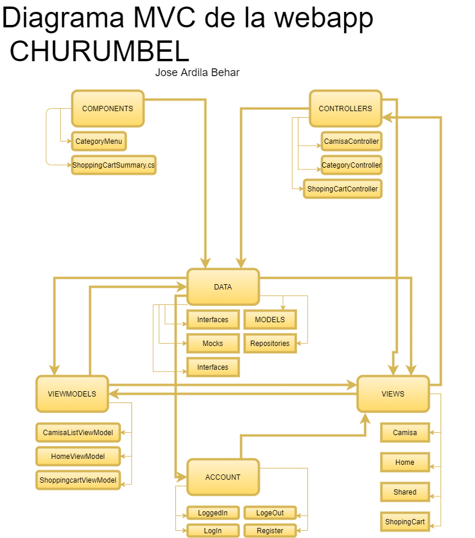

# ParcialTercerCorte-dotnet

Descripción del proyecto : CHURUMBEL es una marca de ropa guiada a las personas que son amantes a los gatos y a el humor, ya que el producto principal de CHURUMBEL son las camisas con fotos y juegos de palabras acompañado con estampados de gatos, como por ejemplo GATAstico, que significa gata y fantastico. La selección de ropa esta dividida en 2 categorías, ropa para hombre y ropa para mujer, al momento de confirmar la compra en el carrito de compras se puede especificar que talla se desea, al momento de terminar con la compra se le notifica al cliente que el método de pago es en efectivo y se este deberá ser proporcionado al momento del domicilio, esto es en parte debido a la situación actual con la pandemia, también es más seguro para el cliente no proporcionar datos delicados de su cuenta bancaria. Al iniciar el cliente deberá iniciar sesión, o registrarse, dependiendo de si es la primera vez que compra algo en esta app, se proporcionan los datos necesarios para que al cliente le llegue una notificación de su método de pago y la fecha estimada del domicilio.

Integrantes : Jose Ardila Behar

Explicación de la arquitectura:  El modelo vista control fue la base de este codigo, como se puede ver en el diagrama, la carpeta MODE, modelos, esta dentro de una carpeta central llamada DATA, esto se debe a que al principio del desarrollo en esta carpeta estaba contenida toda la aplicación, demos de como iban a funcionar interfaces y mocks, de las clases sin hacer uso de alguna base de datos. Una vez terminado este proceso de maquetas se crearon clases encargadas del codigo pesado en esta carpeta, como por ejemploDbInitializer que es la encargada de gestionar todos los dates de la base de datos.Ya despues se crearon las carpetas de control y de vistas, ademas, se crearon carpetas como viwemodel y account y components. Las clases en la carpeta viewmodels reciben de la carpeta Data.models, y estan encargadas de mostrar todo el codigo esta en models. En varias partes de las vistas en la carpeta view se pueden ver lo que son partial views. En la carpeta de Controller ya esta todo el codigo pesado, las funcionalidades que debe mostrar el codigo, como por ejemplo en la clase CamisaControler, hay una funcionalidad de ordenar las camisas segun su categoria, y mostrsr solo la camisa de la categoria que se requiera, ya sea de hombre o de mujer. Las carpetas adicionales son las que se encargan de componentes extra, como por ejemplo el sumario del carrito de compras, o el menu de categorias, tambien la carpeta de account es la que se encarga de todo el manejo de registro, e inicio de sesion.

Este proyecto tuvo como base y ayuda el trabajo de Ervis Trupja y su serie de videos en YouTube "Asp.Net CORE MVC"

